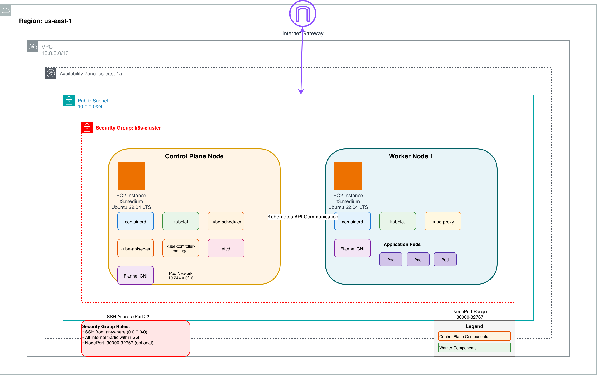

# Building a Kubernetes Cluster on AWS with kubeadm

Ever wondered how Kubernetes clusters actually work under the hood? In this guide, I'll walk you through building your own Kubernetes cluster on AWS from scratch using kubeadm. This hands-on experience will give you a deeper understanding of Kubernetes architecture and help you appreciate what managed services like EKS do behind the scenes.

Whether you're preparing for a certification, building your homelab, or just curious about container orchestration, this step-by-step tutorial has got you covered!

## Architecture Diagram



## What You'll Need

Don't worry—the setup is straightforward! Here's what you'll need before we begin:

- **AWS Account**: You'll need an active AWS account with billing enabled. If you're new to AWS, they offer free tier credits to get started!
- **AWS CLI**: The AWS Command Line Interface on your local machine ([get it here](https://aws.amazon.com/cli/))
  - Quick setup: `aws configure` to authenticate
- **Appropriate Permissions**: Your AWS account should be able to:
  - Create and manage EC2 instances
  - Configure VPC networks and security groups
  - Manage IAM permissions
- **Some Familiarity With**:
  - Basic Linux commands
  - SSH connections
  - Kubernetes fundamentals (though we'll explain as we go!)

## Let's Build This Thing

Ready to get your hands dirty? We'll build this cluster step by step, starting with the infrastructure and working our way up to a fully functioning cluster. I'll explain what each command does and why it matters.

### 1. Setting Up Your AWS Environment

Configure the AWS CLI with your credentials and choose the region you will use for all resources in this guide.

```bash
aws configure
aws ec2 describe-regions
```

Pick a region from the output and use it consistently for the rest of the guide.

### 2. Configuring Network Infrastructure

Create a dedicated VPC and public subnet, then attach an internet gateway and add a default route so instances can reach the internet. Update the availability zone if you chose a different region.

```bash
VPC_ID=$(aws ec2 create-vpc \
  --cidr-block 10.0.0.0/16 \
  --query 'Vpc.VpcId' \
  --output text)

SUBNET_ID=$(aws ec2 create-subnet \
  --vpc-id $VPC_ID \
  --cidr-block 10.0.0.0/24 \
  --availability-zone us-east-1a \
  --query 'Subnet.SubnetId' \
  --output text)

aws ec2 modify-subnet-attribute \
  --subnet-id $SUBNET_ID \
  --map-public-ip-on-launch

IGW_ID=$(aws ec2 create-internet-gateway \
  --query 'InternetGateway.InternetGatewayId' \
  --output text)

aws ec2 attach-internet-gateway \
  --internet-gateway-id $IGW_ID \
  --vpc-id $VPC_ID

ROUTE_TABLE_ID=$(aws ec2 describe-route-tables \
  --filters "Name=vpc-id,Values=$VPC_ID" \
  --query 'RouteTables[0].RouteTableId' \
  --output text)

aws ec2 create-route \
  --route-table-id $ROUTE_TABLE_ID \
  --destination-cidr-block 0.0.0.0/0 \
  --gateway-id $IGW_ID
```

### 3. Securing Your Cluster with Security Groups

Create a security group for the cluster that allows SSH access and unrestricted node-to-node traffic. The example uses 0.0.0.0/0 for SSH; restrict it to your IP if you want tighter security.

```bash
SG_ID=$(aws ec2 create-security-group \
  --group-name k8s-cluster \
  --description 'Security group for Kubernetes cluster' \
  --vpc-id $VPC_ID \
  --query 'GroupId' \
  --output text)

aws ec2 authorize-security-group-ingress \
  --group-id $SG_ID \
  --protocol tcp \
  --port 22 \
  --cidr 0.0.0.0/0

aws ec2 authorize-security-group-ingress \
  --group-id $SG_ID \
  --protocol -1 \
  --source-group $SG_ID
```

### 4. Provisioning the Control Plane Node

Launch a t3.medium Ubuntu 22.04 LTS instance for the control plane, wait for it to be running, and capture its public IP for SSH access.

```bash
CONTROL_PLANE_ID=$(aws ec2 run-instances \
  --image-id ami-0030e4319cbf4dbf2 \
  --instance-type t3.medium \
  --security-group-ids $SG_ID \
  --subnet-id $SUBNET_ID \
  --tag-specifications 'ResourceType=instance,Tags=[{Key=Name,Value=k8s-control-plane}]' \
  --query 'Instances[0].InstanceId' \
  --output text)

echo "Waiting for instance to be ready..."
aws ec2 wait instance-running --instance-ids $CONTROL_PLANE_ID

CONTROL_PLANE_IP=$(aws ec2 describe-instances \
  --instance-ids $CONTROL_PLANE_ID \
  --query 'Reservations[0].Instances[0].PublicIpAddress' \
  --output text)

echo "Control plane instance ready: $CONTROL_PLANE_IP"
```

### 5. Connecting to the Control Plane

Connect to the control plane using EC2 Instance Connect, which handles authentication with your existing SSH key.

```bash
aws ec2-instance-connect ssh --instance-id $CONTROL_PLANE_ID --os-user ubuntu
```

The AWS CLI will automatically use your default SSH key (`~/.ssh/id_rsa.pub`). If you prefer standard SSH, send your public key (valid for 60 seconds) and connect directly.

```bash
aws ec2-instance-connect send-ssh-public-key \
  --instance-id $CONTROL_PLANE_ID \
  --instance-os-user ubuntu \
  --ssh-public-key file://~/.ssh/id_rsa.pub

ssh ubuntu@$CONTROL_PLANE_IP
```

### 6. Preparing the Control Plane Environment

Prepare the OS for Kubernetes by enabling required kernel features, installing `containerd`, and installing the Kubernetes tools.

---

#### 6.1. Prerequisites: System Configuration

Kubernetes requires specific kernel modules and network settings so the container runtime can handle bridged traffic.

##### Load Kernel Modules

Create a configuration file to load the necessary modules at boot and load them now:

```bash
cat <<EOF | sudo tee /etc/modules-load.d/k8s.conf
overlay
br_netfilter
EOF

sudo modprobe overlay
sudo modprobe br_netfilter
```

##### Configure Sysctl

Enable IP forwarding and bridge networking. The sysctl command applies these changes immediately without requiring a reboot.

```bash
cat <<EOF | sudo tee /etc/sysctl.d/k8s.conf
net.bridge.bridge-nf-call-iptables  = 1
net.bridge.bridge-nf-call-ip6tables = 1
net.ipv4.ip_forward                 = 1
EOF

sudo sysctl --system
```

---

#### 6.2. Install containerd

Install `containerd` from the official Ubuntu repositories.

```bash
sudo apt update
sudo apt install -y containerd
```

---

#### 6.3. Configure containerd for Kubernetes

By default, `containerd` does not use the **systemd cgroup driver**, which Kubernetes recommends for stability. Update the config and restart the service.

##### Generate Default Config

Create the directory and generate a clean configuration file:

```bash
sudo mkdir -p /etc/containerd
containerd config default | sudo tee /etc/containerd/config.toml > /dev/null
```

##### Enable Systemd Cgroup Driver

Change `SystemdCgroup = false` to `true`.

```bash
sudo sed -i 's/SystemdCgroup = false/SystemdCgroup = true/' /etc/containerd/config.toml
```

##### Restart containerd

Apply the new configuration:

```bash
sudo systemctl restart containerd
sudo systemctl enable containerd
```

---

#### 6.4. Install kubeadm, kubelet, and kubectl

Add the Kubernetes package repository and install the components. The packages are held to prevent unintended upgrades.

```bash
sudo apt-get update
sudo apt-get install -y apt-transport-https ca-certificates curl gpg

curl -fsSL https://pkgs.k8s.io/core:/stable:/v1.35/deb/Release.key | sudo gpg --dearmor -o /etc/apt/keyrings/kubernetes-apt-keyring.gpg

echo 'deb [signed-by=/etc/apt/keyrings/kubernetes-apt-keyring.gpg] https://pkgs.k8s.io/core:/stable:/v1.35/deb/ /' | sudo tee /etc/apt/sources.list.d/kubernetes.list

sudo apt-get update
sudo apt-get install -y kubelet kubeadm kubectl
sudo apt-mark hold kubelet kubeadm kubectl

sudo systemctl enable --now kubelet
```

### 7. Bootstrapping the Kubernetes Control Plane

Initialize the control plane with the chosen pod network CIDR.

```bash
sudo kubeadm init --pod-network-cidr=10.244.0.0/16
```

Once initialization completes, configure kubectl access for your user account.

```bash
mkdir -p $HOME/.kube
sudo cp -i /etc/kubernetes/admin.conf $HOME/.kube/config
sudo chown $(id -u):$(id -g) $HOME/.kube/config
```

The initialization output includes a join token for worker nodes. You can save it, or generate a fresh one later.

#### Deploy the Pod Network Plugin

Deploy Flannel as the CNI plugin to enable pod-to-pod networking.

```bash
kubectl apply -f https://github.com/flannel-io/flannel/releases/latest/download/kube-flannel.yml
```

#### Enhance Your Command-Line Experience

Enable kubectl auto-completion for the current session and persist it in your bash profile.

```bash
source <(kubectl completion bash)
echo "source <(kubectl completion bash)" >> ~/.bashrc
```

Optionally, create a shorthand alias `k` with the same completion behavior.

```bash
alias k=kubectl
complete -o default -F __start_kubectl k
```

### 8. Adding a Worker Node

Provision a worker node instance, wait for it to be running, and capture its public IP.

```bash
WORKER_ID=$(aws ec2 run-instances \
  --image-id ami-0030e4319cbf4dbf2 \
  --instance-type t3.medium \
  --security-group-ids $SG_ID \
  --subnet-id $SUBNET_ID \
  --tag-specifications 'ResourceType=instance,Tags=[{Key=Name,Value=k8s-worker-1}]' \
  --query 'Instances[0].InstanceId' \
  --output text)

echo "Waiting for worker instance to be ready..."
aws ec2 wait instance-running --instance-ids $WORKER_ID

WORKER_IP=$(aws ec2 describe-instances \
  --instance-ids $WORKER_ID \
  --query 'Reservations[0].Instances[0].PublicIpAddress' \
  --output text)

echo "Worker instance ready: $WORKER_IP"
```

### 9. Connecting to the Worker Node

Connect to the worker node using EC2 Instance Connect.

```bash
aws ec2-instance-connect ssh --instance-id $WORKER_ID --os-user ubuntu
```

Alternatively, use standard SSH by sending your public key (valid for 60 seconds) and connecting directly.

```bash
aws ec2-instance-connect send-ssh-public-key \
  --instance-id $WORKER_ID \
  --instance-os-user ubuntu \
  --ssh-public-key file://~/.ssh/id_rsa.pub

ssh ubuntu@$WORKER_IP
```

### 10. Preparing the Worker Node Environment

Repeat the system configuration and installation steps from section 6 on the worker node (sections 6.1 through 6.4).

### 11. Expanding Your Cluster

Generate a fresh join command on the control plane, then run it on the worker node.

```bash
kubeadm token create --print-join-command
```

This registers the worker node with the cluster.

### 12. Testing Your Cluster with an Nginx Pod

Verify the cluster by deploying a simple nginx pod, inspecting its status, and optionally exposing it.

#### Create and Run an Nginx Pod

Deploy an nginx pod to your cluster:

```bash
kubectl run nginx-test --image=nginx:latest --port=80
```

#### Verify the Pod is Running

Check the status of your pod:

```bash
kubectl get pods
```

You should see output similar to:

```bash
NAME         READY   STATUS    RESTARTS   AGE
nginx-test   1/1     Running   0          30s
```

#### Get Detailed Pod Information

View details about the running pod:

```bash
kubectl describe pod nginx-test
```

#### Expose the Pod (Optional)

If you want to access nginx from within the cluster, create a service:

```bash
kubectl expose pod nginx-test --type=NodePort --port=80
```

Check the service and assigned port:

```bash
kubectl get services nginx-test
```

#### Access Nginx from Your Computer

To access nginx from your local machine, open the NodePort range in the security group and get a node's public IP.

Update your security group to allow traffic on the NodePort range (30000-32767):

```bash
aws ec2 authorize-security-group-ingress \
  --group-id $SG_ID \
  --protocol tcp \
  --port 30000-32767 \
  --cidr 0.0.0.0/0
```

Get the public IP address of your worker node or control plane:

```bash
aws ec2 describe-instances \
  --filters "Name=tag:Name,Values=k8s-*" \
  --query 'Reservations[*].Instances[*].[InstanceId,Tags[?Key==`Name`].Value|[0],PublicIpAddress]' \
  --output table
```

Note the `PublicIpAddress` from the output, then get the NodePort assigned to your service:

```bash
kubectl get service nginx-test -o jsonpath='{.spec.ports[0].nodePort}'
```

This will output a port number between 30000-32767. Access nginx by opening your browser to:

```bash
http://PUBLIC_IP:NODEPORT
```

For example, if your public IP is `54.123.45.67` and NodePort is `31234`, visit:

```bash
http://54.123.45.67:31234
```

You should see the "Welcome to nginx!" page.

#### Clean Up the Test Resources

Remove the nginx pod and service when you're done testing:

```bash
kubectl delete service nginx-test
kubectl delete pod nginx-test
```

If you created the NodePort security group rule, remove it as well:

```bash
aws ec2 revoke-security-group-ingress \
  --group-id $SG_ID \
  --protocol tcp \
  --port 30000-32767 \
  --cidr 0.0.0.0/0
```

### 13. Cleaning Up Resources

Tear down resources in reverse order: terminate the EC2 instances, delete the security group, detach and delete the internet gateway, then remove the subnet and VPC.

```bash
aws ec2 terminate-instances \
  --instance-ids $CONTROL_PLANE_ID $WORKER_ID

aws ec2 wait instance-terminated \
  --instance-ids $CONTROL_PLANE_ID $WORKER_ID

aws ec2 delete-security-group \
  --group-id $SG_ID

aws ec2 detach-internet-gateway \
  --internet-gateway-id $IGW_ID \
  --vpc-id $VPC_ID
aws ec2 delete-internet-gateway \
  --internet-gateway-id $IGW_ID

aws ec2 delete-subnet \
  --subnet-id $SUBNET_ID

aws ec2 delete-vpc \
  --vpc-id $VPC_ID
```

## A Word About Production Readiness

Before we wrap up, let's have an honest conversation: **this cluster is perfect for learning and testing, but it's not production-ready**. Think of this as your training ground—a safe space to experiment, break things, and learn!

### Final Thoughts

Congratulations on building your own Kubernetes cluster! You've gained hands-on experience with container orchestration that many developers never get. Use this setup to experiment, test your applications, and deepen your understanding of how Kubernetes really works.

When you're ready for production, you'll appreciate managed services even more—but you'll also understand what's happening behind the scenes. And that knowledge? Invaluable.

Happy clustering! Feel free to reach out if you have questions or want to share your experience. Let's keep learning together!
